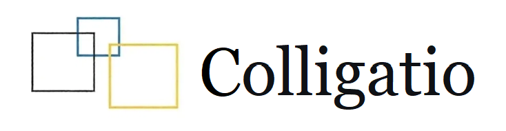
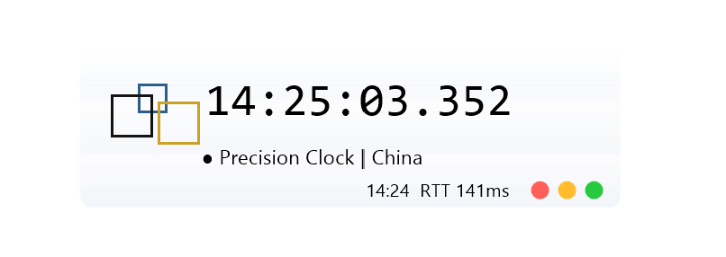
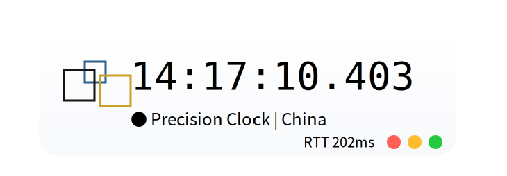
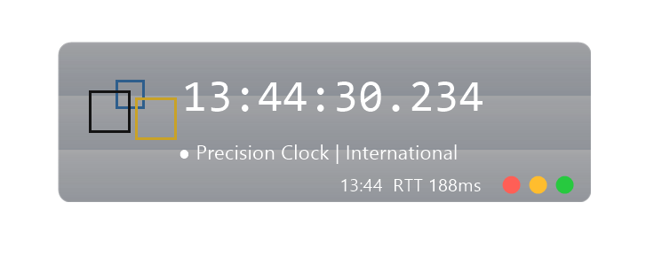
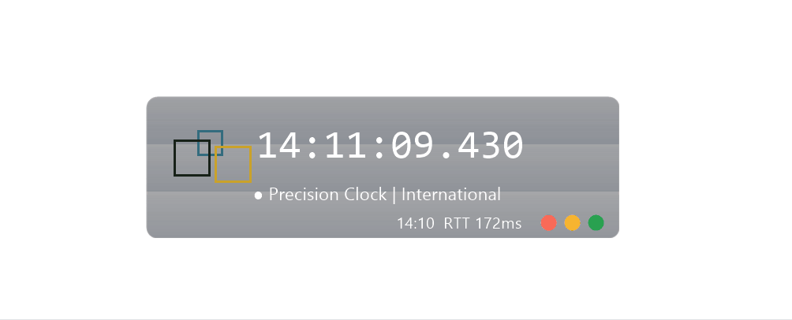

<table>
<tr>
<td></td>
<td align="right"><b>IT 与历史，宽容与理解</b> <b>IT and History, Tolerance and Understanding</b></td>
</tr>
</table>

**简体中文** ｜ [English](#english)

---

## 品牌概况

Colligatio 是一个个人独立技术品牌，专注于操作系统历史考据、技术内容创作与工具开发。

Colligatio 未注册，不具备法人资格，仅为个人品牌标识，由个人发起并持有。目前不设分支机构，不设董事会，不吸收外部投资，不开展商业经营活动。一切项目由发起人自主立项、自主推进、自主归档。

Colligatio 的名称取自拉丁语，作为个人品牌标识使用，不附加其他含义。

## 工作原则

Colligatio 在项目推进中遵循以下原则。

**第一，对历史宽容，对技术理解。**

操作系统的发展有其历史条件。每一个版本、每一项设计、每一次取舍，都是特定环境下的产物。Colligatio 在考据与记录过程中，不以当代标准评判历史决策，不以怀旧情绪修饰历史缺陷，力求还原事实、呈现背景、理解成因。

**第二，工具应稳定、克制，服务于人，而不喧宾夺主。**

Colligatio 开发的工具以稳定性为首要指标，以克制为设计准则。工具应当完成其既定功能，并在完成之后退居后台。不弹窗打扰，不后台采集，不擅自修改系统配置，不索取与功能无关的权限。

**第三，文档应当可考据、可验证、可传承。**

Colligatio 产出的文档、说明与记录，力求做到来源可查、过程可溯、结论可验。引用注明出处，截图注明来源，结论允许被后续研究修正。文档的定位是长期可用的参考资料，而非短期传播的宣传材料。

## 公开联系方式

- colligatio@zohomail.com

以上邮箱为 Colligatio 目前的公开联系方式。

## 法律性质

Colligatio 是未注册个人独立技术品牌，不具备法人资格。

Colligatio 不提供商业担保，不承担因使用其项目所产生的间接损失。

## 我们的作品

### 《Windows 全谱系图鉴》

筹备中。

### Precision Clock / 精密时钟

Precision Clock（精密时钟）是 Colligatio 已发布的开源桌面时间参考工具，采用 GPL-3.0 许可证，目前在 Windows 和 Linux 两个平台同步维护，版本均为 v1.1.0。

产品定位方面，精密时钟面向对时间准确性有要求的用户群体，提供两种运行模式。普通模式精度为 1 秒，优先通过 NTP 校时，连续失败三次后降级至本地时间；精密模式精度为 0.001 秒，强制多源交叉验证，校时失败即报错，不降级至本地时间。

产品特性方面，精密时钟支持多源 NTP 交叉验证、多时区与夏令时、五种语言界面、系统主题跟随、桌面悬浮窗与托盘菜单。不包含广告模块，不采集用户数据，不要求注册账号，不设联网强制校验。

维护方式方面，精密时钟采用版本迭代制，功能更新与缺陷修复通过 GitHub Releases 发布，源码公开可查，构建流程可复现。

---

[简体中文](#简体中文) ｜ **English**

## Brand Overview

Colligatio is an independent personal technical brand focused on operating system history research, technical content creation, and tool development.

Colligatio is unregistered and does not hold legal personality. It is solely a personal brand identifier, initiated and held by an individual. It currently has no branches, no board of directors, no external investment, and no commercial operations. All projects are initiated, advanced, and archived independently by the founder.

The name Colligatio is derived from Latin and is used solely as a personal brand identifier. No additional meaning is attached.

## Working Principles

Colligatio follows the principles below in project advancement.

**First, tolerance toward history, understanding toward technology.**

The development of operating systems is shaped by historical conditions. Every version, every design decision, every trade-off was a product of its particular environment. In its research and documentation, Colligatio does not judge historical decisions by contemporary standards, nor embellish historical flaws out of nostalgia. It seeks to restore facts, present context, and understand causes.

**Second, tools should be stable and restrained — in service to the user, never overshadowing them.**

Tools developed by Colligatio take stability as their primary metric and restraint as their design principle. A tool should fulfill its intended function and then recede into the background. It should not interrupt with pop-ups, collect data in the background, modify system configurations without consent, or request permissions unrelated to its function.

**Third, documentation should be traceable, verifiable, and inheritable.**

Documents, descriptions, and records produced by Colligatio aim to be traceable in source, transparent in process, and verifiable in conclusion. Citations note their sources, screenshots note their origins, and conclusions remain open to correction by subsequent research. Documentation is positioned as a long-term reference, not as short-term promotional material.

## Public Contact

- colligatio@zohomail.com

The email address above is the current public contact channel for Colligatio.

## Legal Nature

Colligatio is an unregistered independent personal technical brand without legal personality.

Colligatio provides no commercial warranty and assumes no liability for indirect damages arising from the use of its projects.

## Our Works

### Windows Genealogy Illustrated

In preparation.

### Precision Clock

Precision Clock is an open-source desktop time reference tool released by Colligatio under the GPL-3.0 license. It is currently maintained on both Windows and Linux, with version v1.1.0 on each platform.

In terms of positioning, Precision Clock targets users who require accurate time, offering two operating modes. Normal mode offers 1-second precision, prioritizing NTP synchronization and falling back to local time after three consecutive failures. Precision mode offers 0.001-second precision, enforcing multi-source cross-validation and reporting errors immediately on failure without falling back to local time.

In terms of features, Precision Clock supports multi-source NTP cross-validation, multiple time zones and DST, a five-language interface, system theme following, a desktop floating window, and a tray menu. It contains no advertising modules, collects no user data, requires no account registration, and imposes no mandatory online validation.

In terms of maintenance, Precision Clock follows a versioned release model. Feature updates and bug fixes are published through GitHub Releases. Source code is publicly available, and the build process is reproducible.

